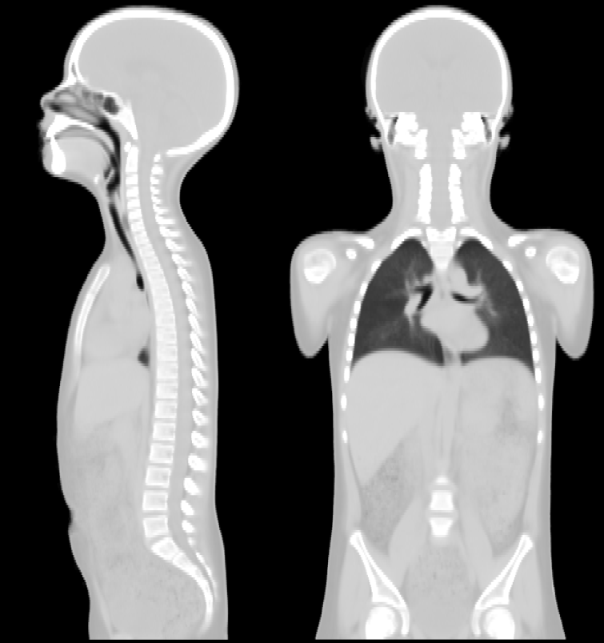

## Welcome to the Radiotherapy Paediatric Atlas (RT-PAL) Project Page

RT-PAL are 3D images that make  a virtual model of an average paediatric patient developed for non-commercial research use.

The RT-PAL 2021 model was generated by merging computed tomography (CTs) from a population of paediatric radiotherapy patients. Full description of the methodology used for its synthesis is published elsewhere (Veiga et al, 2021).

The methodology was later further expanded to generate a series of age and sex-specific models - RT-PAL 2024 models (Ahmad et al, 2024).

The atlases serves as a common reference frame to spatially standardise this complex population, facilitating subsequent analysis of the population. It was developed with the aim of facilitating research into paediatric radiotherapy late effects. Examples of applications include identifying regions of the body more prone to radiation side-effects (voxel-based analysis), estimating out of field dosimetry, etc.
 
The atlas was built through a collaboration with University College London Hospitals NHS Foundation Trust.

## Suggested software tools

[NiftyReg](https://sourceforge.net/projects/niftyreg/) 

## Related publications

C Veiga, P Lim, V Anaya, E Chandy, R Ahmad, D D’Souza, M Gaze, S Moinuddin and J Gains “Atlas construction and spatial normalisation to facilitate radiation-induced late effects research in childhood cancer,” [Phys. Med. Biol. 66 105005 (2021).](https://doi.org/10.1088/1361-6560/abf010)

R Ahmad, J Cantwell, C Borrelli, P Lim, D D’Souza, MN Gaze, S Moinuddin, J Gains, and C Veiga, “Development of age-specific population-based paediatric computational phantoms for image-based data mining and other radiotherapy applications,” [Biomed. Phys. Eng. Express 11 015011 (2024).](https://doi.org/10.1088/2057-1976/ad8c4a)

## Project updates

The 2021 model is available for non-commercial research: [here](https://xip.uclb.com/product/rt-pal-radiotherapy-paediatric-atlas)

2024 models coming soon.

 
## Contact

If you would like to request updates of the availability of data and pipelines, or have any additional queries, please do not hesitate to contact us. Please include your name, institution, department and contact details on requests.

Dr Catarina Veiga

Associate Professor, [Paediatric Radiotherapy & Imaging (PRIma) Group](https://www.ucl.ac.uk/medical-physics-biomedical-engineering/research/research-groups/paediatric-radiotherapy-and-imaging-group-prima)

Centre for Medical Image Computing

Department of Medical Physics & Biomedical Engineering

8th floor, Male Place Engineering Building, Malet Place, London WC1E 6BT

E-mail: c.veiga@ucl.ac.uk

## License

Copyright (c) 2021, University College London

All rights reserved.

